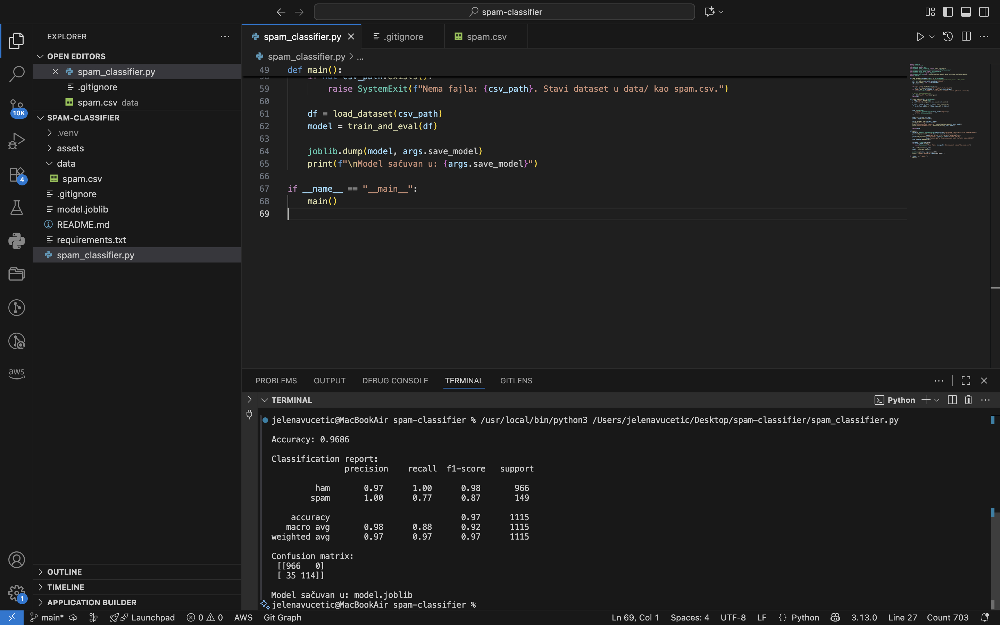
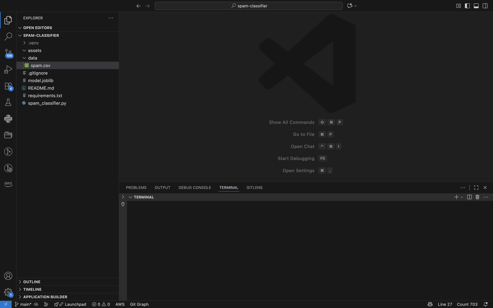

# 📧 Spam Classifier (TF-IDF + Naive Bayes)


This project implements a simple **text classification pipeline** to detect whether a message is **spam** or **ham** (not spam).
It uses **TF-IDF** for feature extraction and **Naive Bayes** as the classification model.

---

## 🚀 Features

- Preprocessing of SMS text data
- Train/test split with stratification
- TF-IDF vectorization
- Naive Bayes classification
- Evaluation metrics (accuracy, precision, recall, F1)
- Model persistence with `joblib`

---

## 📂 Project Structure

```
spam-classifier/
│── data/
│   └── spam.csv         # dataset (SMS Spam Collection)
│── assets/              # screenshots (results, structure)
│── spam_classifier.py   # main pipeline
│── requirements.txt     # dependencies
│── README.md            # project documentation
│── .gitignore
```

---

## 📊 Dataset

We used the **[SMS Spam Collection Dataset](https://www.kaggle.com/datasets/uciml/sms-spam-collection-dataset)** from Kaggle.

- `label` → spam or ham
- `text` → SMS message

---

## ▶️ How to Run

```bash
# create virtual environment
python3 -m venv .venv
source .venv/bin/activate

# install dependencies
pip install -r requirements.txt

# run training + evaluation
python spam_classifier.py --data data/spam.csv
```

The script will print evaluation metrics and save the model (`model.joblib`).

---

## ✅ Results

```
Accuracy: 0.9686

Classification report:
              precision    recall  f1-score   support
ham              0.97       1.00      0.98       966
spam             1.00       0.77      0.87       149
accuracy                             0.97      1115
macro avg        0.98       0.88      0.92      1115
weighted avg     0.97       0.97      0.97      1115

Confusion matrix:
[[966   0]
 [ 35 114]]
```

---

## 📸 Screenshots

### Model Results



### Project Structure



---

## 🔮 Next Steps

- Try `LinearSVC` and compare with Naive Bayes
- Add hyperparameter tuning with `GridSearchCV`
- Deploy as a minimal **FastAPI** endpoint for predictions
